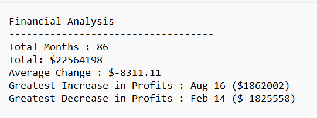

# **Financial Records Analysis**

[Resources](https://github.com/lovecy86/Financial-Record-Analysis/blob/main/PyBank/Resources/budget_data.csv)

[Financial Record Analysis Script](https://github.com/lovecy86/Financial-Record-Analysis/blob/main/PyBank/main.py)

[Result](https://github.com/lovecy86/Financial-Record-Analysis/blob/main/PyBank/analysis/budget_analysis.txt)

## **Overview**
This Python script analyzes financial records for a company using the budget_data.csv dataset, which contains two columns: Date and Profit/Losses. The script calculates key financial metrics, including the total number of months, net total profits/losses, average change in profits/losses, and the greatest increase and decrease in profits with their corresponding dates. This tool automates financial analysis, providing clear and actionable insights for business decision-making.

## **Stakeholder and the Business Question**
The stakeholder for this project is the Business Analysts who analyzes financial data to provide recommendations for operational improvements.
The primary business questions are:
* What are the total number of months included in the dataset?
* What is the net total amount of "Profit/Losses" over the entire period?
* What is the average monthly change in profits/loses?
* What was the greatest increase in profits over the entire period, including the date and amount?
* What was the greatest decrease in profits over the entire period, including the date and time?

## **Prerequisites**
* Python 3.x installed.
* The budget_data.csv dataset, which includes two columns:
    * Date: The date of the financial record.
    * Profit/Losses: The profit or loss amount for that month (integer).
* Basic knowledge of running Python scripts from the command line or an IDE.

## **Analysis**
A Python script is created that analyzes the records to calculate each of the following values:
   

## **Result**
